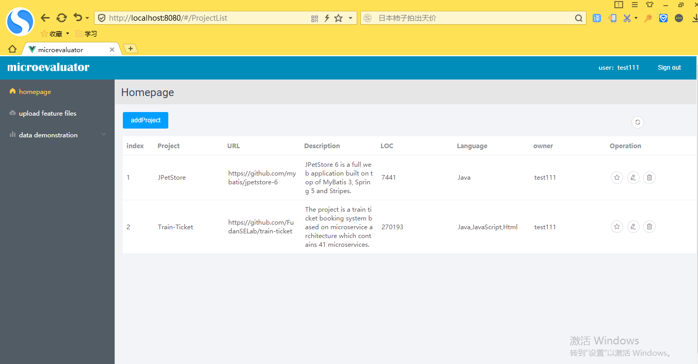
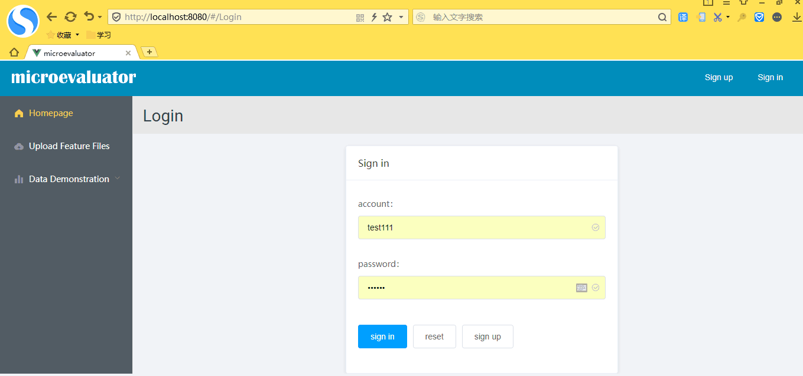
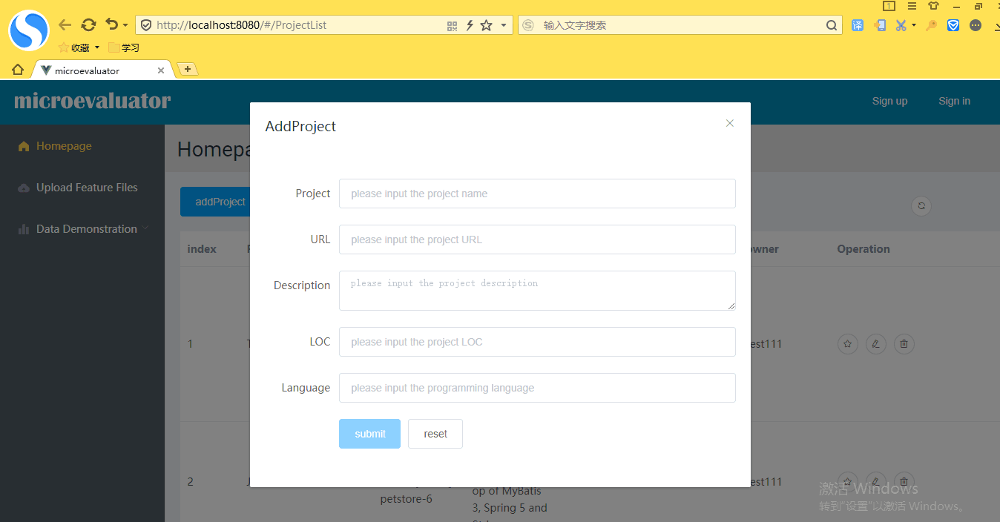
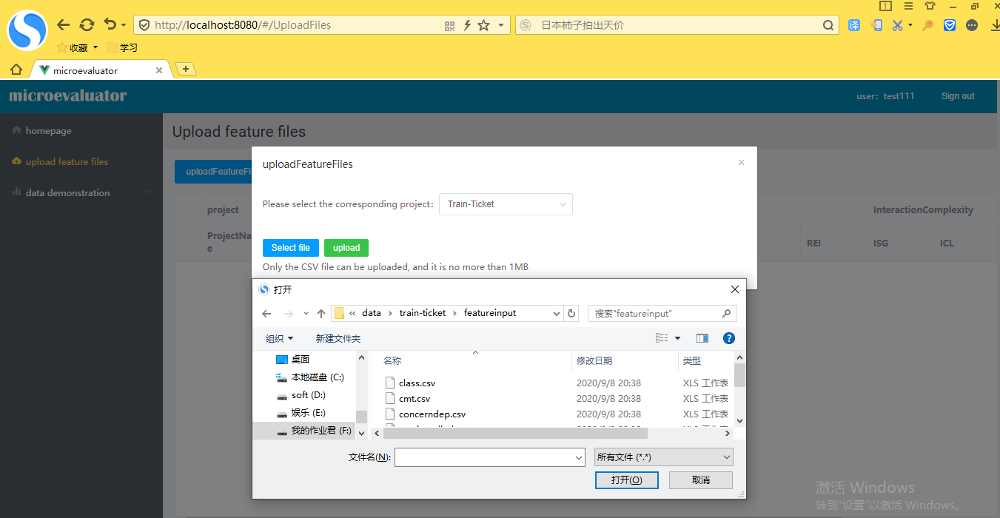
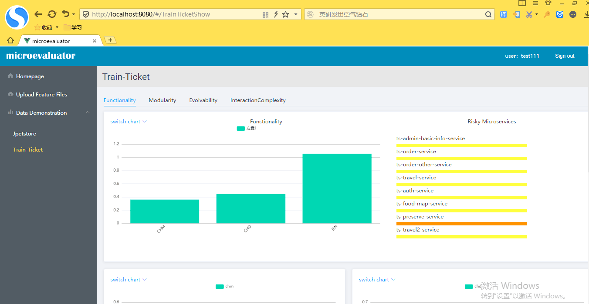
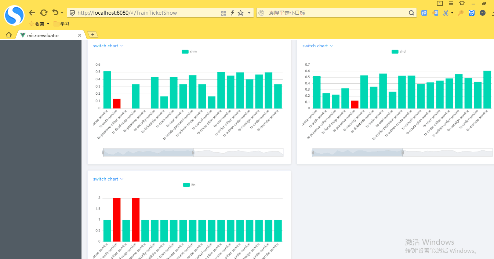
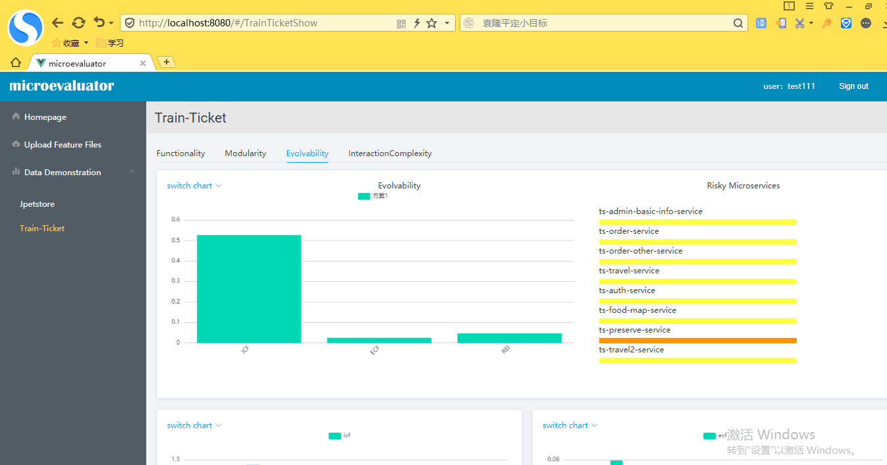
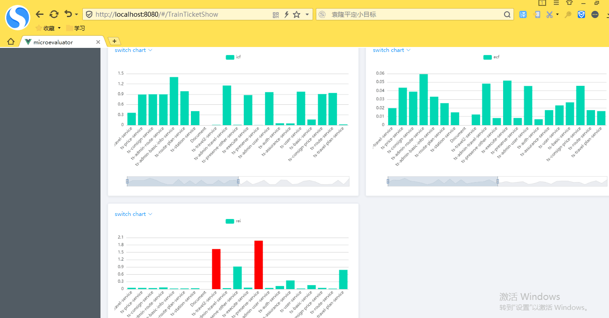
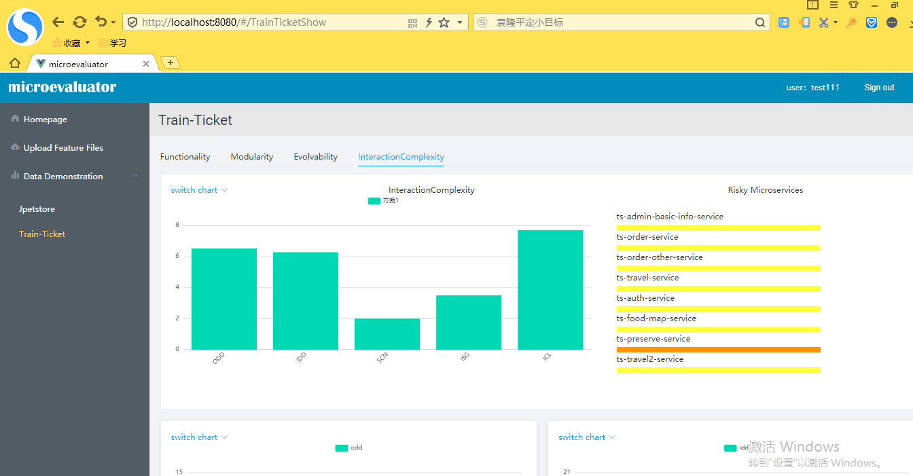
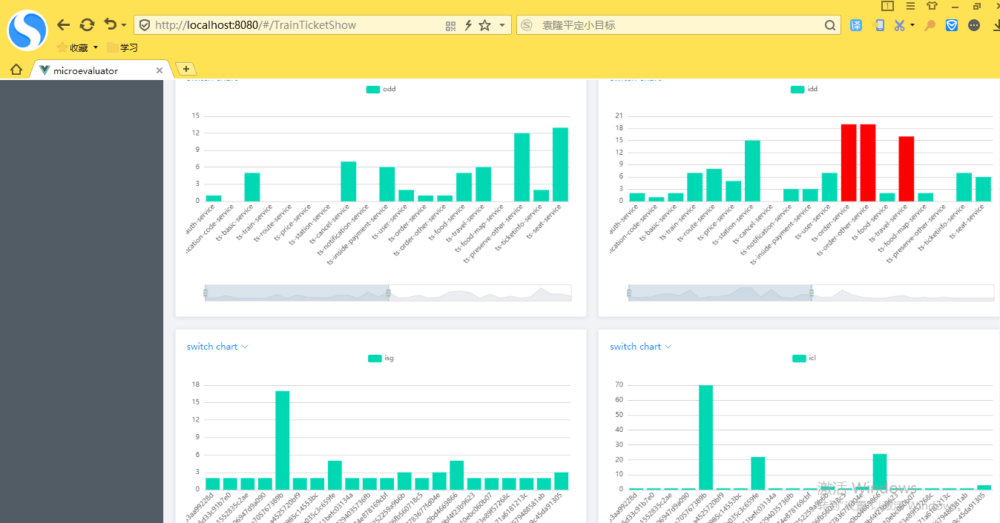

# MicroEvaluator

## Project Introduction

*MicroEvaluator* aims to provide decomposition/decoupling solution and evalaute the solution for the migration from legacy system to a microservice-based architecture. 
The project will identify promising microservice candidates from a legacy software system, evaluate whether these service candidates meet the design principles of services.
MicroEvaluator assesses  the services' quality attributes in terms of  design principles, such as  the single responsility principle, the high cohesion and low coupling, the evolvability, and the low interaction complexity.

## Web

This work consists of two parts: the front-end part for data visualization and the back-end part for data processing and sending.

### Vue-Part

Used to visually display the decomposition results achieved by our microservice decomposition framework, including the decomposed parts, and evaluation of the decomposition results.

### Django-Part

Used to obtain the data passed by the front end, perform microservice decomposition, evaluation and return the results to the front end for display.

## System interface

*工具演示视频地址：https://www.bilibili.com/video/BV1Vi4y1L7bP/ *

### Main Page

Click the homePage button to enter the home page

### Login Page

Enter a username and password to log in

### Creating Project

To create the project, click the Project Upload button and enter the description about the project to be evaluated.

### Uploading Feature Files of Project

In the project overview page, click the select file and click the Upload button to upload the feature files of the project.

### Result

These pages show the result of the maintainability of the microservice system

演示视频地址：https://www.bilibili.com/video/BV1Vi4y1L7bP/
